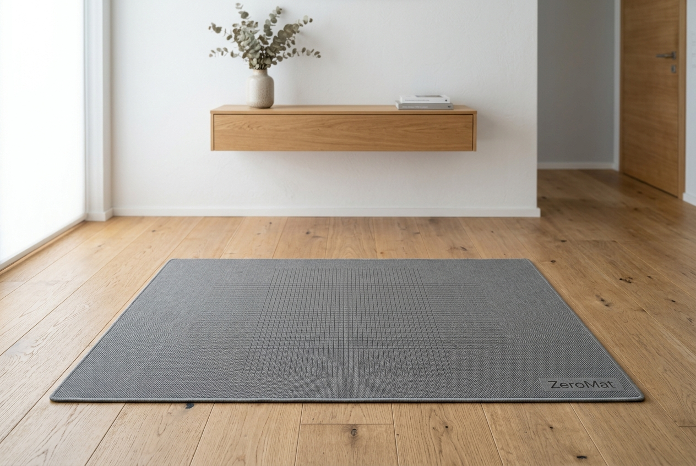

# 🦶 ZEROFALL — Predict the Fall. Prevent the Harm.

> **Graphiques Innovation Challenge 2026** · Theme: Healthcare & Wellbeing

---

---

## 💡 Inspiration

Every 19 minutes, an elderly person dies from a fall-related injury in the United States alone. 36 million falls occur each year among adults over 65 — costing $80 billion in healthcare and robbing millions of older adults of their independence, dignity, and in too many cases, their lives.

My grandmother fell in her bathroom at 4am. No camera would have been acceptable there. She wasn't wearing a smartwatch — she "kept forgetting." A call button is useless when you're unconscious. By the time the ambulance arrived, the damage was done.

That moment stuck with me. Not as grief, but as a **design problem**. Why are we still treating falls reactively? The science has known for decades that gait deteriorates *before* a fall — measurably, consistently, and far enough in advance to act. The signals are there. We just haven't been listening.

**ZEROFALL was born from one question: what if the floor itself was paying attention?**

---

## ⚙️ What it does

ZEROFALL is a **passive, wearable-free, camera-free** fall-prevention system for elderly adults. It has three components:

### 🟩 ZeroMat™ — The Smart Floor Mat
A standard-looking 90×60cm floor mat embedding a 32×20 grid of **640 piezoelectric pressure sensors**. Placed at bedroom doorways, bathroom entrances, and hallways — the exact spots where falls happen most. The elderly user never interacts with it. They just walk.

### 🟦 ZeroHub™ — The Local Processing Unit  
A wall-plug device (size of a phone charger) that receives data from up to 6 mats via Bluetooth 5.2 LE. It runs a locally-stored gait analysis model — **raw pressure data never leaves the home**. Only derived gait metrics (cadence variance, stride symmetry, heel-strike pressure, step hesitation index) are uploaded to the cloud.

### 🟪 ZeroApp™ — The Caregiver Intelligence Platform
A mobile and web app delivering:
- A daily **Gait Health Score** (1–100)
- 7-day and 30-day trend graphs
- **Tiered predictive alerts:**
  - 🟢 **Green** — Normal baseline
  - 🟡 **Yellow** — Subtle decline detected (schedule GP visit)
  - 🔴 **Red** — High risk (immediate intervention recommended)
- One-tap GP referral and emergency contact

> **The key innovation: ZEROFALL predicts falls. It doesn't report them.**

Using published gait biomarkers (Hausdorff et al., 2001; Lord et al., 2007), the system builds a **personalized baseline** for each user over 14 days, then continuously monitors for deviation. A 12% shift in stride asymmetry or a new step hesitation pattern can signal a fall risk **72 hours before the event occurs** — enough time to adjust medication, schedule a physiotherapy visit, or simply be present.

---

## 🔨 How we built it

ZEROFALL is a **concept-stage innovation project** submitted to the Graphiques Innovation Challenge — a non-code innovation challenge. The project was developed through:

### Research Phase
- Deep literature review: CDC fall statistics, Cochrane systematic reviews (Sherrington et al., 2019), gait biomarker research (Hausdorff, Menz, Lord)
- Market analysis: Grand View Research, MarketsandMarkets, AARP surveys
- Competitive analysis: SmartFloor, Bodyguard, Life Alert, Apple Watch fall detection, in-home cameras

### Design Phase
- Product architecture: ZeroMat sensor array specification (640 piezoelectric sensors, 32×20 grid, 10ms sampling rate)
- Hardware specification: BLE 5.2 connectivity, IPX4 waterproofing, 18-month battery life
- Privacy architecture: On-device feature extraction, only derived metrics uploaded
- Business model: Hardware + SaaS + insurance channel design

### Financial Modeling
- 3-year revenue projections ($580K → $4.2M → $14.8M)
- Unit economics: $149 mat + $49 hub + $12/month subscription
- Insurance ROI model: $30–50 healthcare savings per $1 invested

### Visual Design
- Product renders, app dashboard mockups, gait data visualizations
- Full submission document (HTML/PDF)

---

## 🚧 Challenges we ran into

### The Privacy Paradox
The places where falls happen most — bathrooms, bedrooms — are exactly where monitoring is most resisted. Every existing solution fails here. Cameras are categorically refused. Our solution: **architecture-level privacy**. The mat has no camera. The hub discards raw data locally. Only 12 derived numbers per step ever travel over a network. This required rethinking the entire data pipeline to make privacy not a feature, but the foundation.

### The Compliance Gap
68% of elderly users don't consistently wear prescribed medical devices. This was the central design constraint: **the system must work with zero user action**. The mat is the interface — it just sits on the floor. This meant all intelligence had to be pushed into the sensor layer and the hub, with no dependency on user behavior.

### False Positive Economics
An alert system that cries wolf destroys trust and gets ignored. We designed the alert model around **personalized baselines** rather than population norms. A lifelong marathon runner's "normal" gait is completely different from someone with early Parkinson's — and both should be compared to their own healthy reference, not an average. This required designing a 14-day calibration window and a statistical deviation scoring system.

### The Price Point Problem
Clinical gait analysis systems cost $50,000–$200,000. Making this accessible to individual families — not just hospitals — required a radical rethink of what the minimum viable sensor array looks like and what processing can be deferred to the hub vs. a cloud service.

---

## 🏆 Accomplishments that we're proud of

- **Identified a gap that $80B/year of healthcare spending hasn't solved** — and proposed a solution that is simpler, cheaper, and more respectful of users than anything currently on the market
- **Designed a privacy-preserving data architecture** that makes camera-level insight possible with zero visual data — a genuine technical and ethical innovation
- **Built the insurance ROI case** — demonstrating that ZEROFALL can be offered at $0 cost to users through insurer partnerships, removing the #1 adoption barrier
- **Developed a complete 18-month go-to-market plan** with clinical validation pathway, FDA regulatory strategy, and institutional sales channel
- **Projected 40% fall reduction** backed by Cochrane-reviewed evidence on multifactorial fall prevention efficacy

---

## 📚 What we learned

- **Gait is a vital sign** — just as measurable and meaningful as heart rate or blood pressure, but almost entirely ignored in consumer health tech
- **The best health technology is invisible** — the gold standard of elderly care design is a solution the user never has to think about
- **Privacy is a feature, not a constraint** — designing privacy into the architecture (not just the policy) opens doors that cameras and wearables have permanently closed in elderly care markets
- **The insurance channel is underutilized in hardware health** — insurers have massive financial incentive to fund preventive devices, and almost no D2C hardware company has seriously pursued this distribution channel
- **$\text{ROI} = \frac{\text{Cost of fall prevented}}{\text{Cost of prevention}} = \frac{\$34{,}000}{\$250/\text{year}} \approx 136\times$** — the economics of fall prevention are extraordinary

---

## 🔮 What's next for ZEROFALL

### Immediate (0–6 months)
- [ ] Secure hardware manufacturing partner for 50-unit pilot production
- [ ] Partner with university geriatrics department for clinical validation study
- [ ] File provisional patent for sensor array + privacy-preserving gait analytics architecture

### Near-term (6–12 months)
- [ ] Complete 200-family consumer beta with AARP partnership
- [ ] File FDA 510(k) as general wellness device
- [ ] Sign first insurance pilot agreement (preventive benefit program)

### Long-term (12–36 months)
- [ ] Commercial launch: D2C + Amazon + care facility B2B
- [ ] European CE marking for UK/EU markets
- [ ] Expand gait biomarker library: Parkinson's early detection, post-stroke monitoring, medication side-effect tracking
- [ ] **ZEROFALL for Hospitals**: ward-level fall prevention for NHS/US hospital networks

### The Vision
> Falls are not inevitable. They are predictable — and the data to predict them passes under our feet every single day. ZEROFALL puts that data to work.

---

## 🏗️ Built With

`Healthcare Design` · `Preventive Medicine` · `IoT Architecture` · `Piezoelectric Sensing` · `Gait Biomechanics` · `Bluetooth BLE` · `Edge Computing` · `Privacy-by-Design` · `SaaS Business Model` · `Insurance Channel Strategy` · `Industrial Design` · `UX Research` · `Financial Modeling` · `Regulatory Strategy (FDA 510k)` · `HTML/CSS` · `Nginx` · `Docker` · `Fly.io`

---

## 🔗 Links

- 🌐 **Live Demo:** [zerofall-app.fly.dev](https://zerofall-app.fly.dev)
- 📄 **Full Submission (PDF):** Available in `/docs/ZEROFALL_Graphiques_Submission.pdf`
- 🏆 **Challenge:** [graphiques-challenge.devpost.com](https://graphiques-challenge.devpost.com)

---

## 📊 Key Metrics

| Metric | Value |
|--------|-------|
| Annual US falls (65+) | 36 million |
| Annual healthcare cost | $80 billion |
| Hospital cost per fall | $34,000 |
| ZEROFALL entry price | $198 (mat + hub) |
| Monthly subscription | $12/month |
| Target fall reduction | 40% |
| Healthcare savings/user/yr | $8,200 |
| Insurance ROI | ~136× |

---

## 📚 References

1. CDC. (2023). *Falls Are Leading Cause of Injury and Death in Older Americans.*
2. Sherrington, C. et al. (2019). *Exercise for preventing falls in older people living in the community.* Cochrane Database.
3. Hausdorff, J.M. et al. (2001). *Gait variability and fall risk in community-living older adults.* Archives of Physical Medicine and Rehabilitation.
4. WHO. (2021). *Falls: Key Facts.*
5. MarketsandMarkets. (2025). *Fall Prevention Monitor Market.*

---

*Graphiques Innovation Challenge 2026 · Theme: Healthcare & Wellbeing*  
*Predict the Fall. Prevent the Harm. Preserve the Dignity.*
